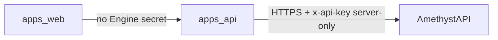

# AmethystDraft ↔ Amethyst Engine integration

[AmethystDraft](https://github.com/Team-Amethyst/AmethystDraft) is the **product UI** (`apps/web`, Vite + React) and **BFF** (`apps/api`, Express + Socket.io). **AmethystAPI** (this repo) is the **Engine**: licensed valuation, catalog, scarcity, simulation, signals; API keys; optional IP allowlist; tier-aware rate limits.

Copy or adapt sections below into the Draft repo **README** or `docs/engine.md` so integration knowledge lives beside Draft code.

## Architecture (complete mediation)



1. **Never** call `https://…/valuation/calculate` (or `/v1/…`) from the browser with `x-api-key`.
2. **Always** proxy through `apps/api` (or equivalent server layer) and read **`AMETHYST_API_KEY`** (or your chosen env name) **only** in server config.
3. Align request bodies with [ENGINE_AGENT_BRIEF.md](../ENGINE_AGENT_BRIEF.md) and [schemas/valuation-request.v1.schema.json](../schemas/valuation-request.v1.schema.json).

Canonical consumer runbook (env names, WAF vs `ENGINE_IP_ALLOWLIST`): [draft-kit-license-runbook.md](draft-kit-license-runbook.md).

## Environment (Draft `apps/api`)

| Variable | Purpose |
|----------|---------|
| `AMETHYST_API_BASE_URL` | Engine origin (no trailing slash ambiguity — normalize in code). |
| `AMETHYST_API_KEY` | Plaintext key for `x-api-key` on **server-side** outbound requests only. |

Add these to **`apps/api/.env.example`** in the Draft repo if not already present. Never reference them from `apps/web` Vite `import.meta.env` **public** keys.

## Mediation audit (checklist — run in AmethystDraft repo)

Run from **AmethystDraft** root:

```bash
# Engine URL or key string in web client (should be empty or only in comments)
rg -n "x-api-key|AMETHYST_API|valuation/calculate|localhost:3002" apps/web --glob '!**/node_modules/**'

# Server-only is OK in api
rg -n "AMETHYST_|x-api-key" apps/api --glob '!**/node_modules/**'
```

- [ ] No `x-api-key` or raw `AMETHYST_API_KEY` in `apps/web` production bundle (use `rg` on build output if needed).
- [ ] All Engine HTTP calls originate from `apps/api` (or server actions), with timeouts and error mapping.
- [ ] **422** (no prices) and **429** (rate limit) surfaced to the UI without leaking key material in logs.

## After every draft edit

- Debounce (e.g. 150–400 ms) then `POST /valuation/calculate` with the **current** flat body built from draft state.
- Engine responses are **not** Redis-cached for that route — safe to refresh on each debounced call.

## Dashboard / rubric “test case valuation interface”

- **Product expectation:** TC1–TC5 flows, checkpoint JSON, and “valuation after edit” UX belong in **AmethystDraft `apps/web`** (dashboard / draft room), backed by `apps/api`.
- **Engine dev playground:** This repo’s `public/` **Playground** tab exercises fixtures against a running Engine — useful for graders and regression, not a substitute for Draft’s dashboard unless the rubric explicitly allows it.

Deliver either:

1. **Implemented** flows in Draft linking to the same checkpoint files / semantics as [test-fixtures/player-api/checkpoints/](../test-fixtures/player-api/checkpoints/), or  
2. **A short mapping doc** in Draft (screenshots / Loom) showing how existing screens satisfy each rubric test case.

## Contract / CI (AmethystDraft)

Add **smoke or contract tests** in Draft CI that:

- Build a minimal valid flat body (or load a fixture file committed in Draft aligned with Engine schema).
- Call Engine staging (or a mock) **from test code running in Node** with `x-api-key` from env.
- Assert `200` + `engine_contract_version`, or structured `400`/`422` for negative cases.

Keep schema drift controlled: mirror or submodule-align with `schemas/valuation-request.v1.schema.json` in this repo.

## Auth model (do not conflate)

| System | Purpose |
|--------|---------|
| **AmethystDraft** | End-user / league auth for the draft product (whatever Draft implements). |
| **AmethystAPI `/api/auth`** | **Developer** portal login for key issuance on the Engine origin (`PortalUser` + session cookie). |

A drafter does not need a Engine portal account to **use** a key issued by an operator; they need the product flow that stores the secret **server-side** on Draft.

## Links

- [draft-kit-license-runbook.md](draft-kit-license-runbook.md)  
- [pre-deploy-testing-keys.md](pre-deploy-testing-keys.md)  
- [rubric-player-api-licensing.md](rubric-player-api-licensing.md)  
- [rubric-player-api-valuations.md](rubric-player-api-valuations.md)  
- [RUBRIC_SUBMISSION_INDEX.md](RUBRIC_SUBMISSION_INDEX.md)
