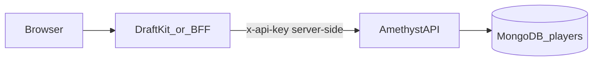

# Draft Kit: licensing, mediation, and valuation calls

This document is the **cross-repo runbook** for teams integrating Draftroom / Draft Kit with **AmethystAPI**. The engine implementation lives in this repository; the browser UI and BFF may live elsewhere.

## Mediation (no bypass)

Intended traffic shape:

Rules:

1. **Never** compute auction dollars (`adjusted_value`, `recommended_bid`, `team_adjusted_value`, …) in the browser or in a client-only bundle. Always call **`POST /valuation/calculate`** (or `/v1/valuation/calculate`) on AmethystAPI with the current league payload.
2. Keep the **API key only on the server** (BFF, App Runner service, Lambda). The browser should call your BFF; the BFF attaches `x-api-key`.
3. **Scopes:** keys must include the scope for each route family (`valuation`, `catalog`, `scarcity`, `simulation`, `signals`). Issued keys from `POST /api/keys/issue` receive all scopes by default; custom keys from `POST /api/keys` must request the scopes they need.

## Environment (.env) for the Draft Kit server

| Variable | Purpose |
|----------|---------|
| `AMETHYST_API_BASE_URL` | Origin of AmethystAPI (e.g. `https://engine.example.com`). |
| `AMETHYST_API_KEY` | Plaintext key (same as `x-api-key` header value). **Server-only.** |
| Optional `ENGINE_IP_ALLOWLIST` on **API** | If set on AmethystAPI, only listed IPs may hit licensed routes; set **`TRUST_PROXY=1`** on the API so `req.ip` is correct behind a proxy. |

Rotate keys via existing **`POST /api/keys/:id/revoke`** and issue new secrets; never log full keys.

## After every draft edit

1. Build the **current** `drafted_players`, budgets, and optional `user_team_id` payload expected by [`NormalizedValuationInput`](../src/types/valuation.ts).
2. **Debounced** `POST /valuation/calculate` (e.g. 150–400 ms) so rapid UI edits do not stampede the API.
3. Rely on the fact that **valuation responses are not Redis-cached** so returned dollars always match the latest request body.

## Developer portal UI (served from this repo)

The static portal at **`public/index.html`** (same origin as the API) registers a **developer account** via **`POST /api/developers`** before the billing placeholder step, then calls **`POST /api/keys/issue`** with **`developerAccountId`** so keys are explicitly tied to that record. There is still **no password login** — the key remains the secret.

For a fully custom UI (Draftroom, etc.), call the same APIs:

Account and key UX should call:

- `POST /api/keys/issue` (shortcut, all scopes) or `POST /api/keys` (full control),
- `GET /api/developers` / related routes as needed,

and store returned secrets **once** (show-copy pattern). See [README](../README.md) authentication section for headers and issuance token behavior.

## Optional: IP control at the edge

If you do **not** use `ENGINE_IP_ALLOWLIST` on the API, restrict source IPs at **WAF / security group** so only the Draft Kit deployment can reach the engine. Document that choice in your deployment repo; either approach satisfies “IP whitelisting” if the rubric allows operational controls.
